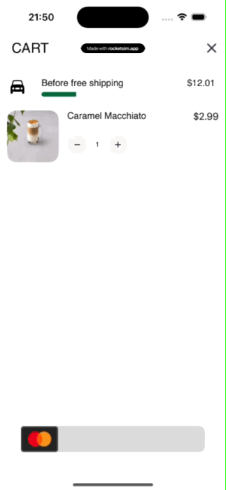
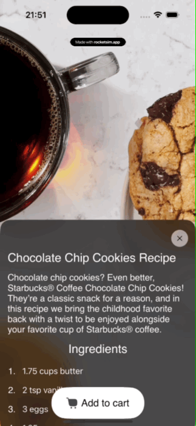

<h1 align="center">Coffee Cascade ☕️ </a> 
<h2 align="left"> Information </h2> 

 I was motivated to create the application by the Drinkit application team of the DoDo Brands team.   The main idea of the application is the practice of SUI and visualization of my ideas.   The API was used from the site https://rapidapi.com/ 

<strong>⚙️ The application has the following functions:</strong>

<li> Viewing the catalog </li>
<li> Making an order </li> 
<li> Overview of coffee recipes </li> 

     

<strong> 🏙️ Tools and Libraries </strong>

<li> iOS 15+  </li>
<li> Swift  </li>
<li> SwiftUI </li> 
<li> Combine </li> 
<li><a href="https://github.com/SwiftfulThinking/SwiftfulRouting">SwiftfulRouting</a></li>
<li><a href="https://github.com/onevcat/Kingfisher">Kingfisher</a></li>
</ul>

     

<strong> 📸 Video: </strong>

<h1 align="left"><a href="https://youtube.com/shorts/Yqb6JN-obm4?feature=share" target="_blank">Video Preview(click)</a> 

<table>
  <tr>
    <td align="center">
      
    </td>
    <td align="center">
      
    </td>
    <td align="center">
      
    </td>
        <td align="center">
      
    </td>
  </tr>
</table>
